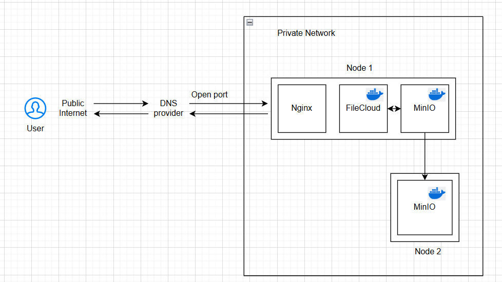

# FileCloud with MinIO Replication

This setup integrates **FileCloud** with a **highly available MinIO object storage**, ensuring data redundancy and scalability. MinIO is deployed on two nodes with replication enabled, providing fault tolerance and seamless data synchronization. FileCloud is configured to use MinIO as its primary storage, enhancing performance and durability. This setup is ideal for enterprises looking for a **scalable, S3-compatible private cloud storage solution**.

#### First setup MinIO 
[MinIO setup](MinIO.md)

#### Then setup FileCloud
[FileCloud setup](FileCloud.md)

#### It should be looking like this

##### Contributors
- [@Nilay Tayade](https://github.com/nilaytayde)
- [@Pranav Kolte](https://github.com/Pranavkolte23)
- [@Shreyash Dhas](https://github.com/shreyashdhas0604)
- [@Varad Deokar](https://github.com/varad0710)